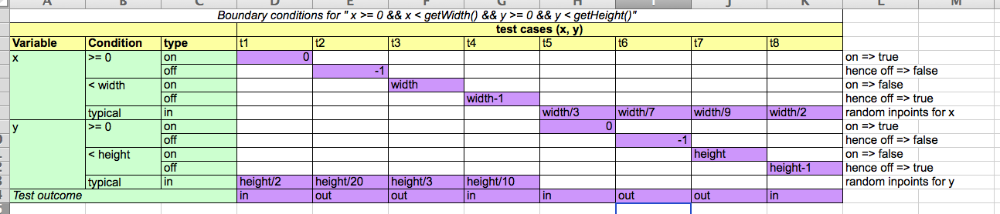
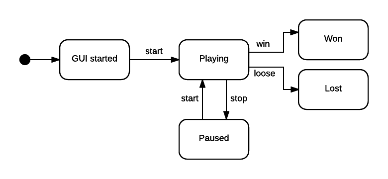
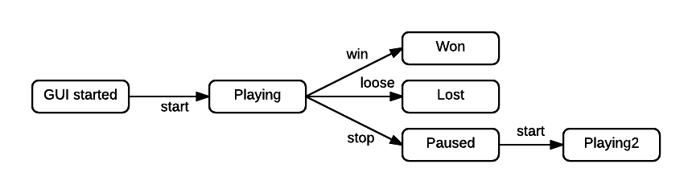

Report
======

#3.1 Smoke Testing

##3.1.1
The overall line coverage was found to be 82%. The `CollisionInteractionMap`
and the `DefaultPlayerInteractionMap` both have 0% coverage. This is because
`CollisionInteractionMap` is only used by `DefaultPlayerInteractionMap`, which,
in turn, is never referred to by any classes that are instantiated during the 
smoke test.

We added the following error to the game: we replaced the direction in the
`Game.move()` method to `Direction.NORTH`. The smoke test captured this with 
a failing test. 

##3.1.2
The `move()` method is covered. After commenting out the last line of the `move()` 
method, the smoke test generated the error:

`org.junit.ComparisonFailure: expected:<[1]0> but was:<[]0>
 Expected :10
 Actual   :0`

The trace reveals: 

`at nl.tudelft.jpacman.LauncherSmokeTest.smokeTest(LauncherSmokeTest.java:69)`

which indicates that the test failed on line 69, which contains the code:

`assertThat(player.getScore()).isEqualTo(10);`

We can conclude that something must have gone wrong between the previous assertion
(on line 65) and this one. The only line in between these two assertions in the smoke
test is line 68:

`game.move(player, Direction.EAST);`

So, the smoke test tells us that we should investigate this method call further.

##3.1.3 
When we changed the `board.Direction.getDeltaX()` method, the smoke test failed in
exactly the same way as in the previous exercise. So, while the smoke test _is_ able
to tell us that we should investigate the call to `game.move(player, Direction.EAST);`,
it does not tell us whether the problem resides with the method itself or with the 
objects that are being passed _to_ the method.


#3.2 Feature-Based Testing

##3.2.6
For the second `Given` statement in S2.4 it is hard to realise proper timing of movements,
in order for the player to be next to a ghost.
For the `When` statement in S2.5 it is hard to realise exact timing of movements, so that
pacman has eaten all but one pellets, without colliding with a ghost.

##3.2.8
All of the scenarios in User Story 3 pertain to ghosts, which are automatically moved around.
Because of this, it is not possible to test the moves using `game.move()` as before. Moreover, 
Ghost itself is an abstract class, which means we would have to test the individual ghosts, thereby 
creating additional test cases. Furthermore, the Ghost classes do not have built-in methods to return the 
current square in the way that Player does. The situation is further complicated by the fact that the 
different Ghosts not only move differently from each other, but also differently depending on certain 
scenarios in the game. 


#3.3 Boundary Testing 

##3.3.9 




#3.4 Understanding your tests

##3.4.11
If the test methods in a class start with duplicate initialization code this can be moved into
a common initialization method with the @Before annotation, because this method will be executed
before every single execution of a test method.
Also, when a method needs to be tested using multiple values as input 
(as in boundary testing for example),the test can be parameterized,
which prevents writing same pieces of code around the input values.

##3.4.12
Using clean instances of the class under test, is necessary for independence among tests.
The impact that one test has on another should be minimized to be sure that when a test fails,
it only fails because of that test.

##3.4.13
The difference between `assertTrue(a == 1)` and `assertEquals(a, 1)` is that
the `assertEquals` gives a comparison of the expected value with the actual value, 
whereas `assertTrue` does not. So `assertEquals` is more useful, as it provides information
that can be used debug a failing test. 

##3.4.14
One could make the argument that it is not necessary to test the private methods of `MapParser` because 
all of the end-to-end tests rely on a `Launcher` which makes use of `MapParser`. So, we would expect a 
faulty `MapParser` to yield failing end-to-end tests. However, it is also the case that a faulty `MapParser`
may make it difficult to debug the failing end-to-end tests, without having isolated tests of the private
methods of `MapParser` itself. Furthermore, a passing test does necessarily not guarantee anything if the test
itself has faults. So, a passing end-to-end test does not neceaarily guarantee that `MapParser` would not 
fail an isolated test. In conclusion, it would probably be a good idea to test the private methods in isolation. 

##3.5 

###3.5.15

There is one warning that remains in IntelliJ. IntelliJ complains that `public class WithinBordersTest` can be private. We left this public
because the comment in `ParameterizedAssignment` specifically states that it needs to be public. 

In terms of the additional adequacy achieved thanks to our classes, we measured the new overall
coverage to be 89%, with a line coverage of 84%. So, our efforts have contributed 2 percentage points 
to the overall line coverage, as compared to what we measured in question 3.1.1.

The continuous integration server confirmed that our builds worked properly in most cases. We generally 
tried to avoid successively failing builds on DevHub, as evidenced by the many green commits. We used Git
very extensively. In general, we tried to make new branches for different exercises. This allowed us to divide 
the work effectively and gives a very clear record of what was done. 

#4.3 Testing Collisions

##4.3.20

|         | r1           | r2                  | r3          | r4             |
| ------- | ------------ | ------------------- | ----------- | -------------- |
| player  | collider     | collider            | collidee    |                |
| ghost   | collidee     |                     | collider    | collider       |
| pellet  |              | collidee            |             | collidee       |
|         |              |                     |             |                |
| outcome | player moves | player moves        | ghost moves | ghost moves    |
|         | player dies  | player earns points | player dies | pellet remains |
|         |              | pellet disappears   |             |                |
|         |              |                     |             |                |

##4.3.24

|                             | framework line coverage | our line coverage |
| --------------------------- | ----------------------- | ----------------- |
| CollisionInteractionMap     | 0%                      | 94%               |
| DefaultPlayerInteractionMap | 0%                      | 100%              |
| PlayerCollisions            | 75%                     | 79%               |

Line coverage on PlayerCollisions have somewhat increases (4%).
The original jpacman-framework did only cover collisions in which the player was the collider.
We covered collisions with a ghost as collider aditionally.

The collision functionality that remains unchecked is the case when a pellet is the collider.
This however, is not a functionality that is specified by the requirements and can therefore be left unchecked.

Also coverage on CollisionInteractionMap and DefaultPlayerInteractionMap have increased drastically,
only by applying the PlayerCollisions testsuite on them too.

#4.4 Complex Tests

###4.4.25
It should not be the goal to achieve 100% test coverage, because this is very easily achieved by writing tests that
are not meaningful.

An advantage of code coverage can be the ability to spot a decrease in code coverage of a pull request.

A disadvantage is that high coverage can provide a false sense of stability. 100% coverage for example does not imply
an absence of faults.

##4.4.26

`LauncherSmokeTest.smokeTest()` can become flakey as a result of an assumption that the call to `Thread.sleep(500L)`
will be sufficient to bring the monsters within 20 steps of the player. Since the movement of the monsters depends on 
a random number generator, the movements of the ghosts are not explicitly guaranteed to meet this criterion. So, the 
call to `assertThat(player.isAlive()).isFalse()` can sometimes yield a failing test. The paper by Luo et al. identifies 
the three main causes of flakey tests as (1) "ASYNC WAIT": asynchronous calls which do not properly wait for the resource being 
called, (2) concurrency and (3) test order dependency. Each type of flakey test has its own fix. For example, for ASYNC WAIT, 
a common fix prescibed by Luo et al. is to enforce the blocking of a given thread through `waitFor`. But, the overarching 
theme of these fixes is that we need to enforce determinism in our tests.

###4.4.27
A test that needs to communicate with infrastructure dependencies like a database or http server will slow
the entire test suite dramatically. To mitigate this issue, you can mock these depencies and still test the interaction.

###4.4.28

One disadvantage of using mocks is that one could make the mistake of testing a mock by accident without realizing
it. When using the more advanced features of certain mocking frameworks there is a risk of misunderstanding what 
exactly that code is doing, which may result in green tests which don't actually test the software that is supposed to be tested. 
Furthermore, the overextensive use of mocking can lead to slower tests and possible problems that result from the interactions
between the mocks themselves. 

###4.4.29
Mocking should mostly be done during unit testing, because it provides isolation of the class under test.
Mocking can be done during integration testing for some dependencies that are not directly under test.
Mocking should not be done during system testing, because the whole system should be under test and 
when using mocks, you are partly testing your mocks instead of the real implementation.

#5.1 State Machines

##5.1.31


##5.2.32


| Test Case ID | Start State | Events             | End State   |
| :----------- | :---------- | :----------------- | :---------- |
| T1           | GUI Started | start, win         | Won         |
| T2           | GUI Started | start, loose       | Lost        |
| T3           | GUI Started | start, stop, start | Playing     |

##5.2.33                                                 
| States      	| Events 	|         	|     	|      	|
|:--------------|-----------|-----------|-------|-------|
|             	| Stop   	| Start   	| Win 	| Lose 	|
|               |-----------|-----------|-------|-------|
| GUI Started 	|        	| Playing 	|     	|      	|
| Playing     	| Paused 	|         	| Won 	| Lost 	|
| Paused      	|        	| Playing 	|     	|      	|


(state, event) pairs not contained in diagram: \
(GUI Started, stop) \
(GUI Started, win) \
(GUI Started, loose) \
(Playing, start) \
(Paused, stop) \
(Paused, win) \
(Paused, loose) 

#5.2 Multi-Level Games

##5.2.37


##5.2.38

| Test Case ID | Start State | Events                   | End State         |
| ------------ | ----------- | -------------------------|------------------ |
| T1           | GUI Started | start, win level (<4)    | Playing New Level |
| T2           | GUI Started | start, lose              |   Lost            |
| T3           | GUI Started | start, stop, start       | Playing Level     |
| T4           | GUI Started | start, win level (=4)    |   Won Game        |

T2 and T3 could almost be reused, since they don't involve any change in the level. But, it may still be necessary to 
modify them slightly, since they should make use of the MultiGameLauncher, rather than the Launcher, T1 would have to be
modified further.


#5.3 Test Smells

##5.3.46

Below, the `testWithinBorders` method has been changed to a smelly multiple
assertions test. Instead of being parameterized and using a single `assertEquals`, 
the test now uses multiple asserts and multiple types of asserts. Since 
`assertTrue` and `assertFalse` don't give the expected and resulting values, 
it would be difficult to determine why the test failed, since there are multiple
assertions that would give the same output on failure. In contrast to this, the
original, parameterized version of this test allows us to identify specifically
which input caused the test to fail.


````
@Test
    void testWithinBorders(int x, int y, boolean z) {
            int x = 0;
            int y = 3;
            assertTrue(board.withinBorders(x, y));
           `y = -1;
            assertFalse(board.withinBorders(x, y));
            y = -6;
            assertEquals(board.withinBorders(x, y), false);
            y = 0;
            x = -1;
            assertFalse(board.withinBorders(x, y));
            x = 3;
            assertThat(board.withinBorders(x, y)).isEqualTo(true);
            x = 1;
            assertTrue(board.withinBorders(x, y));
            x = 4;
            y = 2;
            assertEquals(board.withinBorders(x, y), false);
            x = 2;
            y = 5;
            assertTrue(board.withinBorders(x, y));
    }
````

##5.3.47
Below, the `testAddSquareGround` method from the `MapParserTest` class has been turned into an Irrelevant
Details test. In contrast to the original test method, the method below does not use any mocks. As a result, 
the test could fail as a result of details that are irrelevant to the method that we want to test. For example,
the improper implementation of BoardFactory, LevelFactory, and Square could all cause the test to fail for 
reasons that have nothing to do with the `addSquare` method that we wish to test. Futhermore, the use of 
`asssertTrue` further obfuscates the results, since it does not print the expected and actual values. 

````
void testAddSquareGround() {
        Square grid = new Square(1,1);
        Square sq = new Square(1,1);
        grid[0][0] = null;
        BoardFactory bf = new BoardFactory();
        LevelFactory lf = new LevelFactory();
        MapParser mp = new MapParser(lf, bf);
        List<NPC> gh = new ArrayList<>();
        List<Square> = new ArrayList<>();

        mp.addSquare(gr, gh, sp, 0, 0, ' ');
        
        assertTrue(gr[0][0] == sq);

    }

````

#5.5 

##5.5.48